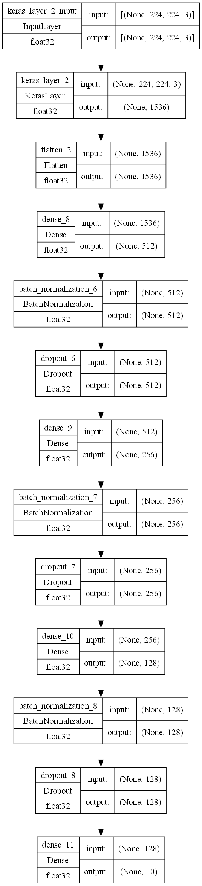

# Vision-AI: Eye Disease Diagnosis Platform

## Overview
Vision-AI is a full-stack AI-powered platform for diagnosing eye diseases from fundus images. It features a robust Flask backend serving a Keras deep learning model (EfficientNetV2 via TensorFlow Hub) and a modern React frontend for user interaction. The backend is containerized with Docker for easy deployment, and the frontend is ready for hosting on Vercel. The backend can be deployed on Render or any cloud provider.

---

## Features
- **AI Diagnosis:** Upload fundus images and receive instant predictions for multiple eye diseases.
- **Deep Learning Model:** EfficientNetV2-based Keras model trained on a diverse dataset.
- **Modern UI:** React + Tailwind CSS frontend for a seamless user experience.
- **REST API:** Flask backend exposes a `/predict` endpoint for image inference.
- **Dockerized Backend:** Easy to build and deploy anywhere.
- **Cloud Ready:** Backend deployable on Render, frontend on Vercel.
- **CORS Enabled:** Secure cross-origin requests between frontend and backend.

---

## Project Structure
```
Vision-AI/
├── backend/
│   ├── app.py                  # Flask API server
│   ├── requirements.txt        # Python dependencies
│   ├── eye_disease_model.h5    # Trained Keras model
│   └── notebook/               # Model training notebooks & data
├── frontend/
│   ├── src/
│   │   ├── components/         # React components (AIDiagnosis, DiseaseLibrary, etc.)
│   │   └── ...
│   ├── package.json            # Frontend dependencies
│   └── ...
├── Dockerfile                  # Docker build for backend
└── README.md                   # (You are here)
```

---

## Backend (Flask + Keras)

### Key Files
- `backend/app.py`: Flask app with `/predict` endpoint, model loading, and image preprocessing.
- `backend/requirements.txt`: All required Python packages (TensorFlow, Flask, OpenCV, etc.).
- `backend/eye_disease_model.h5`: Trained Keras model file (EfficientNetV2, TensorFlow Hub).
- `Dockerfile`: Containerizes the backend for deployment.

### API Endpoint
- **POST** `/predict`
  - **Body:** `multipart/form-data` with an `image` file.
  - **Response:**
    ```json
    {
      "diagnosis": "Glaucoma",
      "confidence": 0.98
    }
    ```

### Image Preprocessing
- Images are resized to 224x224, converted to RGB, and preprocessed with `tf.keras.applications.resnet.preprocess_input` to match model training.

### Class Mapping
- The backend `CLASS_NAMES` matches the order of `train_generator.class_indices` from training.

### Running Locally
```bash
cd backend
pip install -r requirements.txt
python app.py
```
- The API will be available at `http://127.0.0.1:5000`.

### Docker Usage
Build and run the backend container:
```powershell
docker build -t eye-disease-backend .
docker run -p 5000:5000 eye-disease-backend
```

---

## Frontend (React + Vite + Tailwind)

### Key Files
- `frontend/src/components/AIDiagnosis.tsx`: Handles image upload and calls the backend API.
- `frontend/src/App.tsx`: Main app structure and routing.
- `frontend/package.json`: Frontend dependencies.

### API URL Configuration
- The frontend uses an environment variable for the backend API URL:
  - In `.env` (in `frontend/` root):
    ```env
    VITE_REACT_APP_API_URL=https://your-backend.onrender.com
    ```
- Defaults to `http://127.0.0.1:5000` for local development.

### Running Locally
```bash
cd frontend
npm install
npm run dev
```
- The app will be available at `http://localhost:5173` (or as shown in the terminal).

---

## Deployment

### Backend on Render
1. Push your backend code (including `eye_disease_model.h5`) to a GitHub repo.
2. Create a new Web Service on [Render](https://dashboard.render.com/):
   - **Build Command:** (leave blank)
   - **Start Command:** `python app.py`
   - **Environment Variables:** Set `PORT=5000` if needed.
3. If your model file is too large for GitHub, upload it via Render Shell after deploy.
4. Note your Render backend URL (e.g., `https://your-backend.onrender.com`).

### Frontend on Vercel
1. Push your frontend code to GitHub.
2. Create a new project on [Vercel](https://vercel.com/), selecting the `frontend/` directory.
3. Add the environment variable `VITE_REACT_APP_API_URL` with your Render backend URL.
4. Deploy!

---

## Environment Variables
- **Backend:**
  - `PORT` (optional, default 5000)
- **Frontend:**
  - `VITE_REACT_APP_API_URL` (set to your backend URL)

---

## Troubleshooting
- **Docker build errors:** If you see errors fetching Debian packages, retry or use a different mirror as in the Dockerfile.
- **Model file not found:** Ensure `eye_disease_model.h5` is in the correct location and copied in Dockerfile.
- **CORS errors:** The backend uses `flask-cors` to allow frontend requests.
- **TensorFlow warnings:** Warnings about missing CUDA libraries are normal on CPU-only deployments.

---

## Credits
- Model architecture: EfficientNetV2 via TensorFlow Hub
- Frontend: React, Vite, Tailwind CSS
- Backend: Flask, TensorFlow, OpenCV

---

## License
This project is for educational and research purposes. Please check dataset and model licenses before commercial use.

---

## Model Architecture

The model used for eye disease classification is based on EfficientNetV2 (via TensorFlow Hub) as a feature extractor, followed by several dense, batch normalization, and dropout layers for robust classification. Below is a visual summary of the model architecture:



- **Input:** (224, 224, 3) RGB fundus images
- **Feature Extractor:** EfficientNetV2 (KerasLayer from TensorFlow Hub)
- **Dense Layers:**
  - Dense(512) → BatchNorm → Dropout
  - Dense(256) → BatchNorm → Dropout
  - Dense(128) → BatchNorm → Dropout
  - Output: Dense(10) (softmax for 10 classes)
- **Regularization:** BatchNormalization and Dropout after each dense layer

This architecture enables the model to learn robust features from fundus images and generalize well to unseen data.
